# 🛡️ SOC Detection Lab — Wazuh SIEM + Suricata IDS


> **End-to-end SOC detection pipeline** integrating Suricata IDS with Wazuh SIEM.

**Prepared by:** Ayesha | Information Security Analyst
**Organization:** Vital Medicure Labs


## Lab Overview

This project demonstrates a complete **Security Operations Center (SOC) detection pipeline** built from open-source tools. Suricata 8.0 acts as the network IDS sensor on Rocky Linux, forwarding all alerts via `eve.json` to Wazuh SIEM. Two real attack scenarios were executed — Nmap stealth port scan and XSS web attack — both detected in real time.

### What Was Demonstrated
- ✅ Network-layer threat detection (Nmap SYN stealth scan → 195 alerts)
- ✅ Application-layer threat detection (XSS injection → 2 alerts)
- ✅ End-to-end SIEM integration via eve.json log forwarding
- ✅ Real-time alert visibility in Wazuh Discover dashboard
- ✅ Emerging Threats ruleset covering 50+ attack categories

## Step 01 — Suricata 8.0 Installation on Rocky Linux

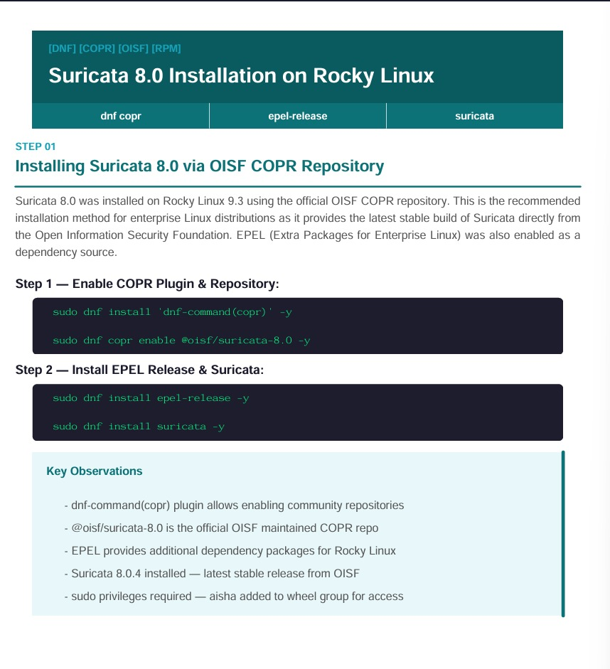

```bash
sudo dnf install 'dnf-command(copr)' -y
sudo dnf copr enable @oisf/suricata-8.0 -y
sudo dnf install epel-release -y
sudo dnf install suricata -y
```

**Key Points:**
- `@oisf/suricata-8.0` is the official OISF-maintained COPR repo
- EPEL provides additional dependency packages for Rocky Linux
- Suricata **8.0.4** installed — latest stable release

## Step 02 — Emerging Threats Rules Configuration

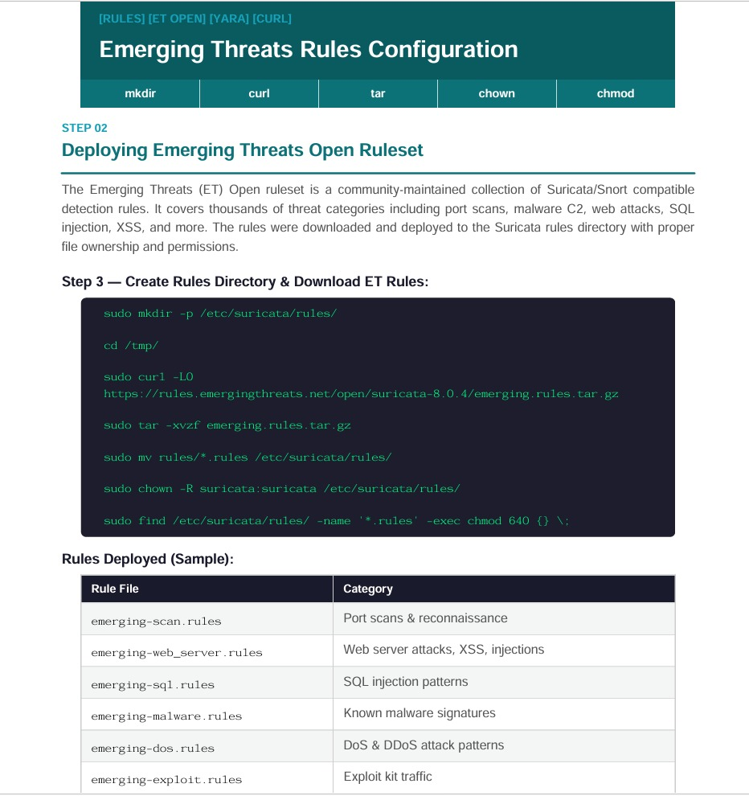

```bash
sudo mkdir -p /etc/suricata/rules/
cd /tmp/
sudo curl -LO https://rules.emergingthreats.net/open/suricata-8.0.4/emerging.rules.tar.gz
sudo tar -xvzf emerging.rules.tar.gz
sudo mv rules/*.rules /etc/suricata/rules/
sudo chown -R suricata:suricata /etc/suricata/rules/
sudo find /etc/suricata/rules/ -name '*.rules' -exec chmod 640 {} \;
```

**Key Points:**
- 5,323 KB ruleset — 50+ rule files covering all major attack categories
- `chmod 640` restricts rule files — readable by suricata group only

## Step 03 — Suricata YAML Configuration

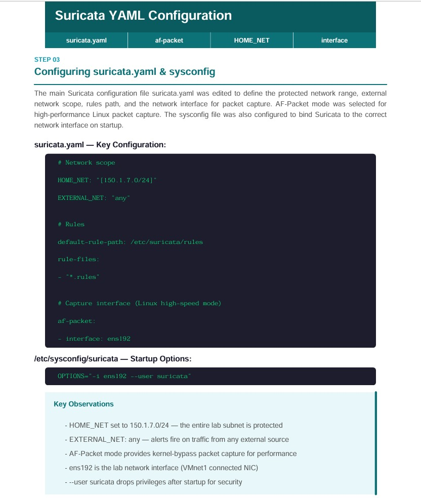

```yaml
HOME_NET: "[150.1.7.0/24]"
EXTERNAL_NET: "any"

default-rule-path: /etc/suricata/rules
rule-files:
  - "*.rules"

af-packet:
  - interface: ens192
```

```bash
# /etc/sysconfig/suricata
OPTIONS="-i ens192 --user suricata"
```

**Key Points:**
- `HOME_NET` set to `150.1.7.0/24` — entire lab subnet protected
- AF-Packet mode provides kernel-bypass packet capture
- `--user suricata` drops privileges after startup for security

## Step 04 — Suricata Service Active & Running

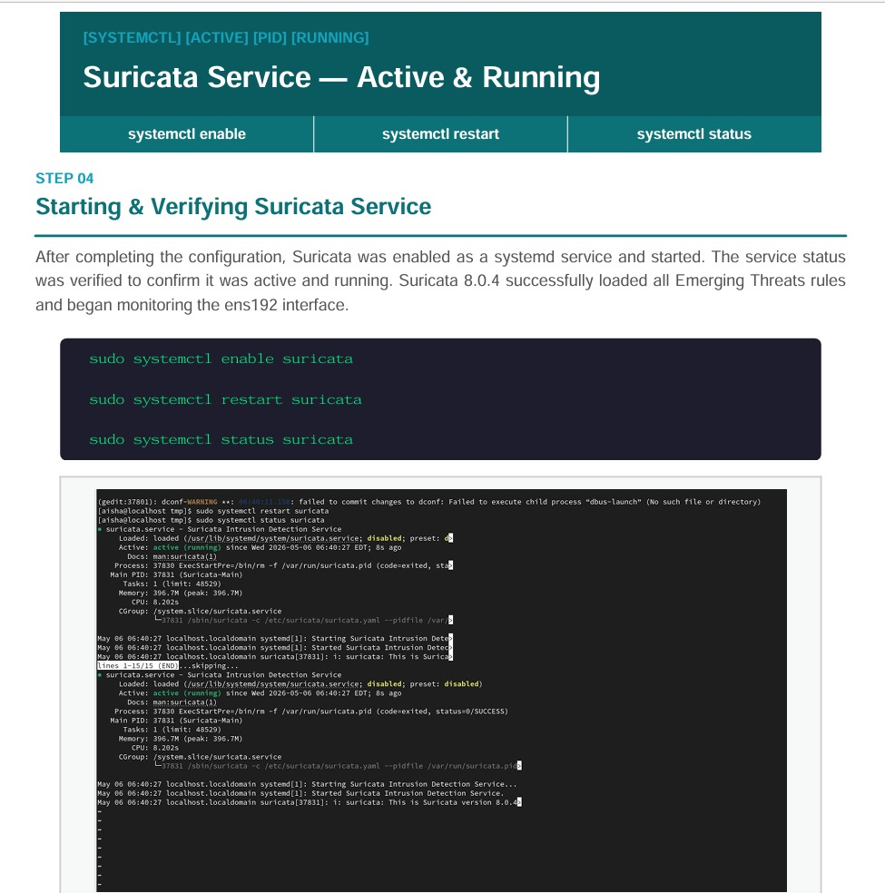

```bash
sudo systemctl enable suricata
sudo systemctl restart suricata
sudo systemctl status suricata
```

**Key Points:**
- ✅ Suricata version **8.0.4** confirmed
- ✅ Status: `Active (running)`
- ✅ Main PID: **37831**
- ✅ Memory: **396.7M** — all ET rules loaded into memory
- ✅ CPU startup: **8.202s** — full rule compilation confirmed

## Step 05 — Wazuh Agent Installation

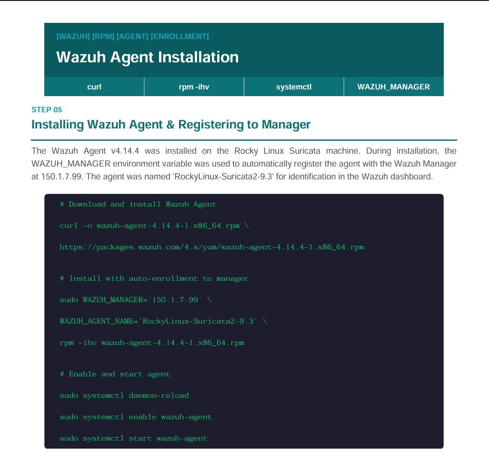

```bash
curl -o wazuh-agent-4.14.4-1.x86_64.rpm \
  https://packages.wazuh.com/4.x/yum/wazuh-agent-4.14.4-1.x86_64.rpm

sudo WAZUH_MANAGER='150.1.7.99' \
     WAZUH_AGENT_NAME='RockyLinux-Suricata2-9.3' \
     rpm -ihv wazuh-agent-4.14.4-1.x86_64.rpm

sudo systemctl daemon-reload
sudo systemctl enable wazuh-agent
sudo systemctl start wazuh-agent
```

**Key Points:**
- `WAZUH_MANAGER` env variable auto-enrolls agent during install
- Agent named `RockyLinux-Suricata2-9.3` for dashboard identification
- Agent connects to Wazuh Manager at **150.1.7.99**

## Step 07 — Agent Verified in Wazuh Dashboard

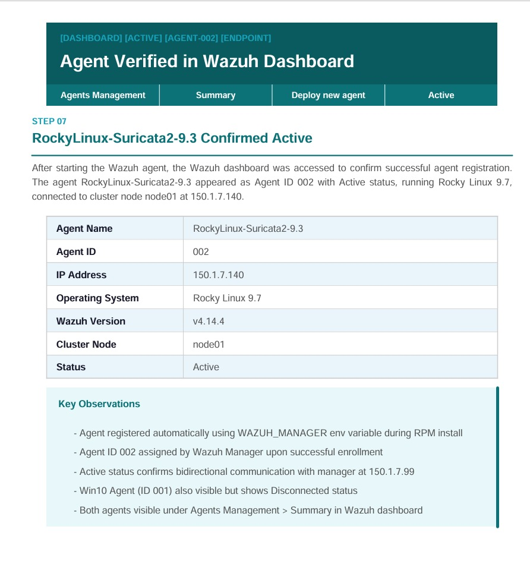

| Field | Value |
|-------|-------|
| Agent Name | RockyLinux-Suricata2-9.3 |
| Agent ID | 002 |
| IP Address | 150.1.7.140 |
| Operating System | Rocky Linux 9.7 |
| Wazuh Version | v4.14.4 |
| Cluster Node | node01 |
| Status | ✅ Active |

**Key Points:**
- Agent auto-enrolled using `WAZUH_MANAGER` env variable during RPM install
- Agent ID **002** assigned by Wazuh Manager upon successful enrollment
- Active status confirms bidirectional communication with manager at **150.1.7.99**

## Step 08 — Nmap Port Scan Attack from Kali

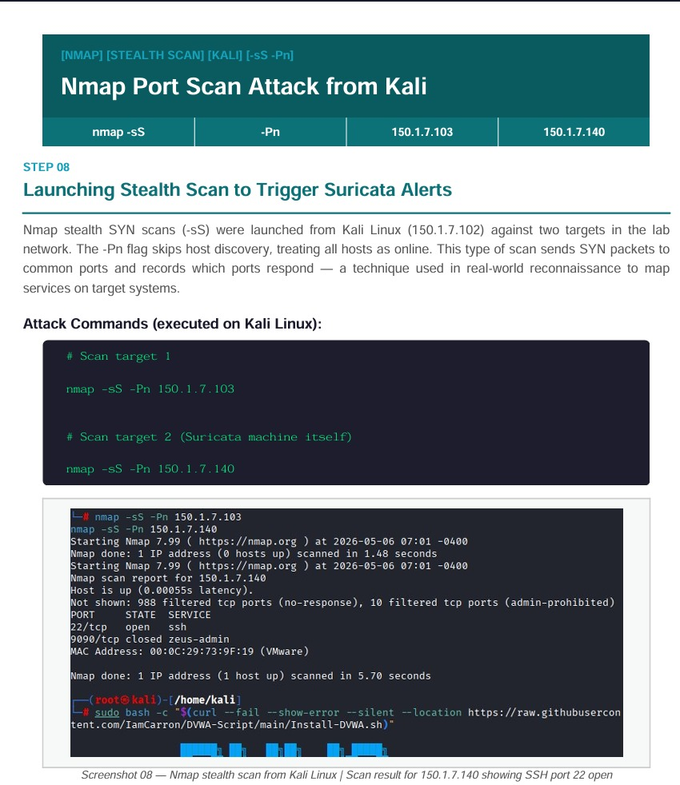

Nmap stealth SYN scans were launched from Kali Linux (150.1.7.102) against two targets in the lab network to simulate real-world reconnaissance activity.

**Attack Commands:**
- `nmap -sS -Pn 150.1.7.103`
- `nmap -sS -Pn 150.1.7.140`

**Key Points:**
- `-sS` sends SYN packets only — stealthier than full TCP connect scan
- `-Pn` skips ping — treats host as online even if ICMP is blocked
- Port 22 (SSH) open, Port 9090 (zeus-admin) closed on 150.1.7.140
- 988 filtered ports detected — scan completed in 5.70 seconds
- Scan immediately triggered **ET SCAN** rules in Suricata

## Step 09 — Wazuh Alerts — Port Scan Detection

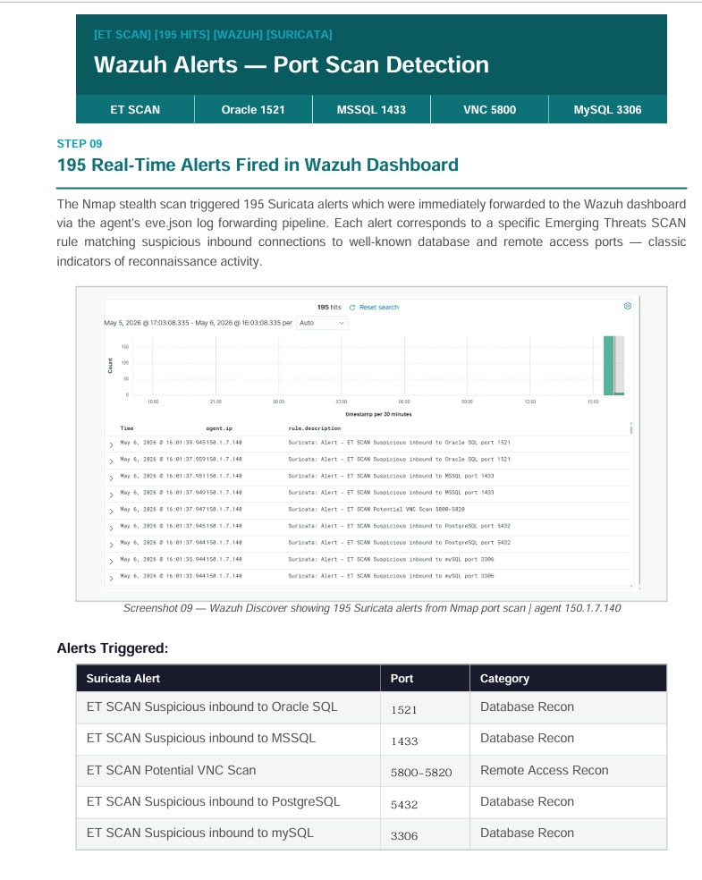

The Nmap stealth scan triggered **195 real-time Suricata alerts** forwarded immediately to the Wazuh dashboard.

| Suricata Alert | Port | Category |
|----------------|------|---------|
| ET SCAN Suspicious inbound to Oracle SQL | 1521 | Database Recon |
| ET SCAN Suspicious inbound to MSSQL | 1433 | Database Recon |
| ET SCAN Potential VNC Scan | 5800–5820 | Remote Access Recon |
| ET SCAN Suspicious inbound to PostgreSQL | 5432 | Database Recon |
| ET SCAN Suspicious inbound to MySQL | 3306 | Database Recon |

**Key Points:**
- 195 hits confirmed in Wazuh Discover dashboard
- All alerts fired within seconds of the Nmap scan
- Classic indicators of reconnaissance activity detected

## Step 10 — DVWA Installation on Kali Linux

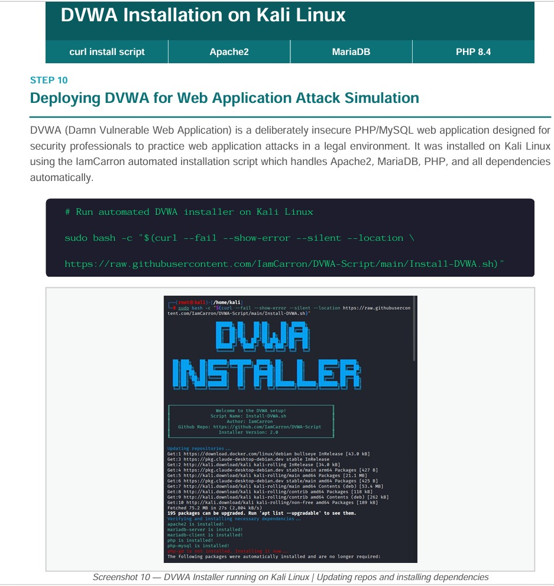
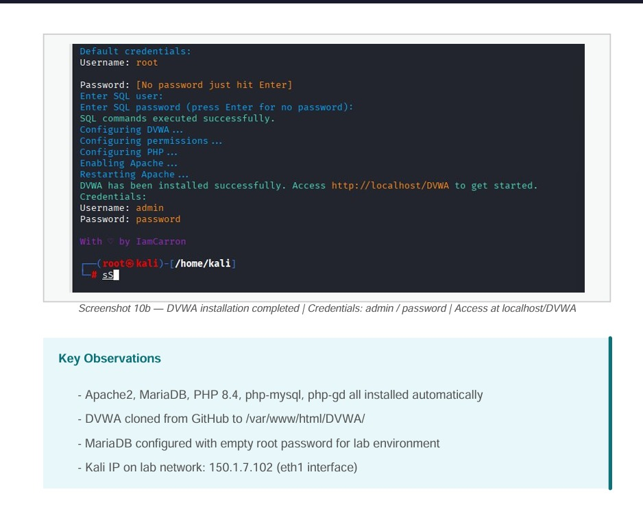

DVWA (Damn Vulnerable Web Application) was installed on Kali Linux using the IamCarron automated installer — handling Apache2, MariaDB, PHP 8.4, and all dependencies automatically.

```bash
sudo bash -c "$(curl --fail --show-error --silent --location \
  https://raw.githubusercontent.com/IamCarron/DVWA-Script/main/Install-DVWA.sh)"
```

**Key Points:**
- Apache2, MariaDB, PHP 8.4, php-mysql, php-gd all installed automatically
- DVWA cloned from GitHub to `/var/www/html/DVWA/`
- MariaDB configured with empty root password for lab environment
- Kali IP on lab network: **150.1.7.102** (eth1 interface)

## Step 11 — DVWA Login & Dashboard Access

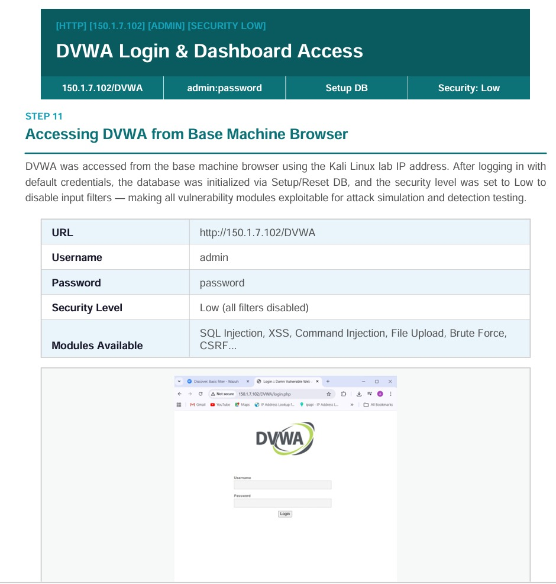
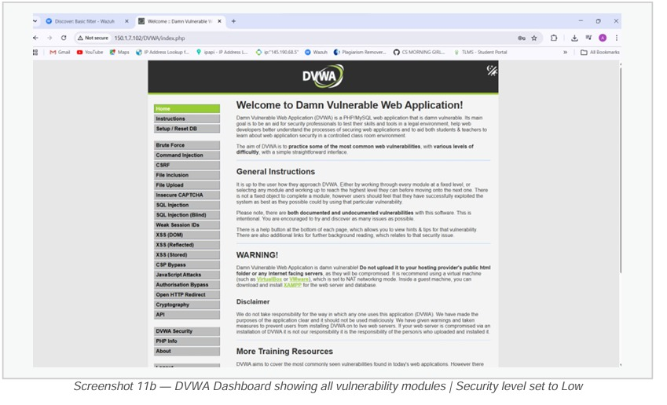

| Field | Value |
|-------|-------|
| URL | http://150.1.7.102/DVWA |
| Username | admin |
| Password | password |
| Security Level | Low (all filters disabled) |
| Modules Available | SQL Injection, XSS, Command Injection, File Upload, Brute Force, CSRF |

**Key Points:**
- Database initialized via Setup/Reset DB after login
- Security level set to **Low** — all input filters disabled
- All vulnerability modules fully exploitable for detection testing

## Step 12 — XSS Attack & Suricata Detection

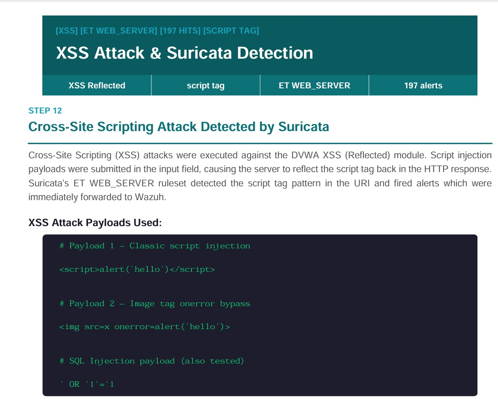
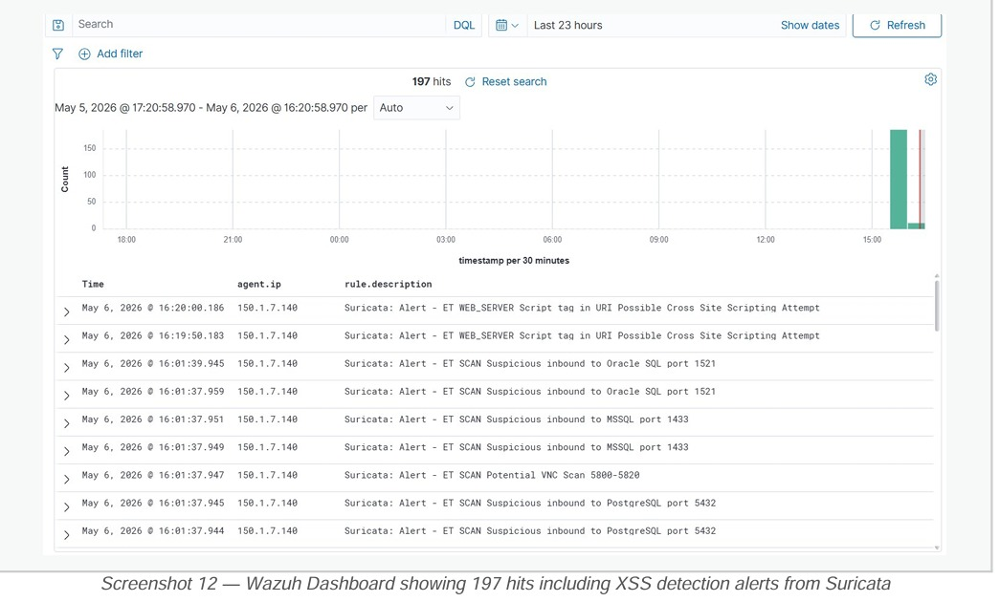
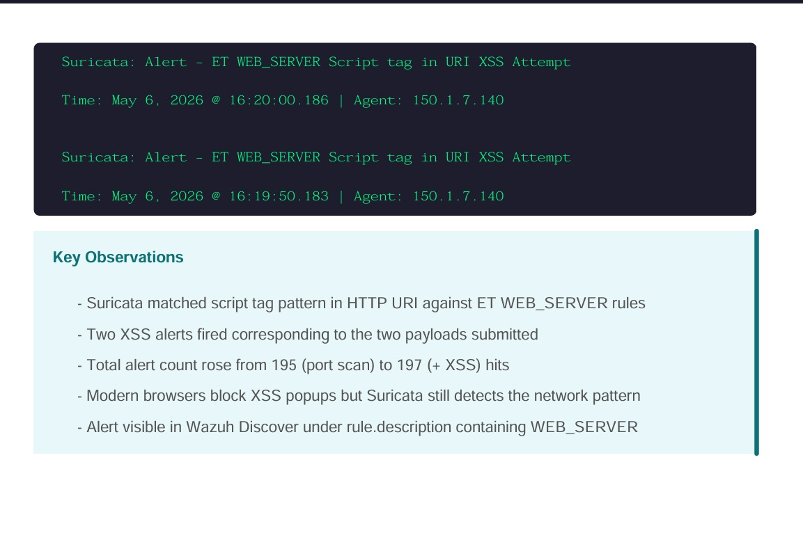

Cross-Site Scripting attacks were executed against the DVWA XSS (Reflected) module. Suricata's ET WEB_SERVER ruleset detected the script tag pattern in the HTTP URI and fired alerts immediately forwarded to Wazuh.

**XSS Payloads Used:**
- Payload 1 — Classic script injection: `<script>alert('hello')</script>`
- Payload 2 — Image tag onerror bypass: ``
- SQL Injection also tested: `' OR '1'='1`

**Key Points:**
- Suricata matched `<script>` tag pattern in HTTP URI against ET WEB_SERVER rules
- 2 XSS alerts fired — one per payload submitted
- Total alert count rose from 195 (port scan) → **197 total**
- Modern browsers block XSS popups but Suricata still detects the network pattern

## Lab Summary & Results

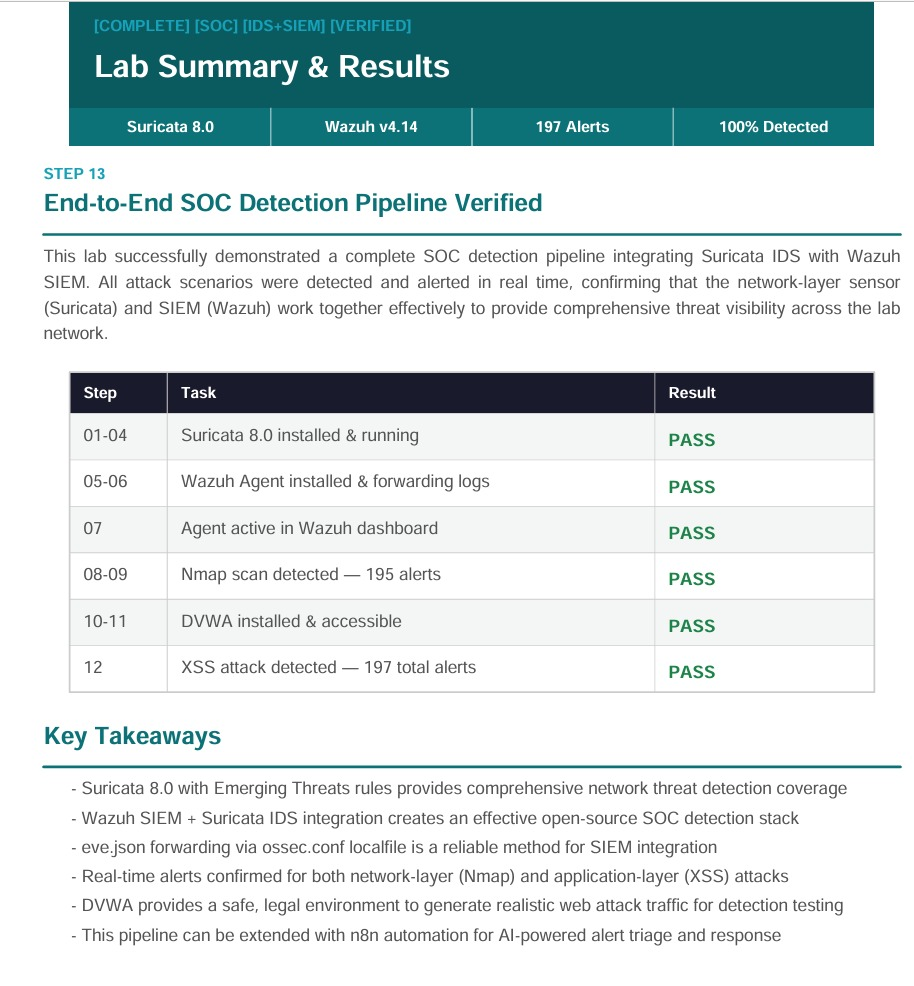

| Step | Task | Result |
|------|------|--------|
| 01–04 | Suricata 8.0 installed & running | ✅ PASS |
| 05–06 | Wazuh Agent installed & forwarding logs | ✅ PASS |
| 07 | Agent active in Wazuh dashboard | ✅ PASS |
| 08–09 | Nmap scan detected — 195 alerts | ✅ PASS |
| 10–11 | DVWA installed & accessible | ✅ PASS |
| 12 | XSS attack detected — 197 total alerts | ✅ PASS |

**Overall: 6/6 Tasks Passed — Full SOC Pipeline Verified ✅**

---

## Key Takeaways

- Suricata 8.0 with Emerging Threats rules provides comprehensive network threat detection
- Wazuh SIEM + Suricata IDS creates an effective fully open-source SOC detection stack
- `eve.json` forwarding via `ossec.conf` localfile is a reliable SIEM integration method
- Real-time detection confirmed for both network-layer (Nmap) and application-layer (XSS) attacks
- This pipeline can be extended with **n8n automation** for AI-powered alert triage and response

---

## Skills Demonstrated

`SIEM Integration` `IDS Deployment` `Network Threat Detection` `Web Attack Detection`
`Log Forwarding` `SOC Pipeline Design` `Emerging Threats Ruleset` `Detection Engineering`
`Rocky Linux` `Kali Linux` `Suricata` `Wazuh` `DVWA` `Nmap` `XSS`

---

*Ayesha | Information Security Analyst | Vital Medicure Labs | 
  
