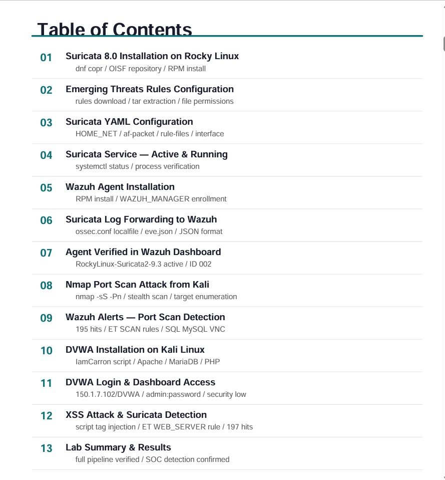

# 🛡️ SOC Detection Lab — Wazuh SIEM + Suricata IDS

> **End-to-end SOC detection pipeline** integrating Suricata IDS with Wazuh SIEM.

**Prepared by:** Ayesha | Information Security Analyst
**Organization:** Vital Medicure Labs

## Lab Overview

This project demonstrates a complete **Security Operations Center (SOC) detection pipeline** built from open-source tools. Suricata 8.0 acts as the network IDS sensor on Rocky Linux, forwarding all alerts via `eve.json` to Wazuh SIEM. Two real attack scenarios were executed — Nmap stealth port scan and XSS web attack — both detected in real time.

### What Was Demonstrated
- ✅ Network-layer threat detection (Nmap SYN stealth scan → 195 alerts)
- ✅ Application-layer threat detection (XSS injection → 2 alerts)
- ✅ End-to-end SIEM integration via eve.json log forwarding
- ✅ Real-time alert visibility in Wazuh Discover dashboard
- ✅ Emerging Threats ruleset covering 50+ attack categories
